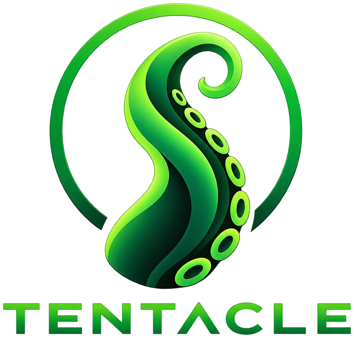

  

  <b>Your Jellyfin music, on your phone and natively in Android Auto.</b>

  
  
  
  

Tentacle is a music player for [Jellyfin](https://jellyfin.org) servers. It streams straight from your own
server and plays the music itself, both on your phone and in the car through Android Auto, so no other app
needs to be running.

> Tentacle is an independent, unofficial app. It isn't affiliated with or endorsed by the Jellyfin project.

## Features

| | |
|---|---|
| 🎵 **Now playing** | Artwork, seek bar, previous/play/next, shuffle, repeat, and Up next |
| 📚 **Library** | Home, Songs (all of them, A–Z), Albums (four sort orders), Artists and Playlists |
| 🔎 **Search** | Songs, artists and albums as you type |
| 🚗 **Android Auto** | The same library as car tabs, plus now playing, Up next, search and voice ("Hey Google, play … on Tentacle") |
| 🎧 **Everywhere** | Lock screen and notification, Bluetooth, headset and steering-wheel buttons; pauses when headphones disconnect; resumes where you left off |
| 📶 **Streaming quality** | Original, or 320 / 192 / 128 kbps MP3 to save data. Files the phone can't play are converted automatically. |
| 🌐 **Away from home** | Optional [Tailscale](https://tailscale.com) support: Tentacle turns your Tailscale VPN on only when your server can't be reached (for example in the car), and off again when you're done |
| 📊 **Server-friendly** | Reports what you play, so Jellyfin's Recently played and play counts stay accurate |
| 🔒 **Private** | Talks only to your server: no ads, analytics or tracking. Tailscale support only asks the Tailscale app to connect. |

## Project status

| | |
|---|---|
| **Android** | Version 0.6.4. Builds and passes CI. Tested on a phone, on the Android Auto emulator and in a car. A few car checks are still open ([open items](docs/SECURITY_ASSESSMENT.md#8-open-items)). |
| **iOS** | Planned: a native Swift app with CarPlay |
| **Releases** | Source tagged [`v0.5.0`](https://github.com/majoseph25/tentacle/releases/tag/v0.5.0). No downloadable app yet: build from source (below). |

## Getting started

1. **Build and install** from source: open this folder in [Android Studio](https://developer.android.com/studio)
   and press **Run**. Command-line build instructions are in the [development guide](docs/DEVELOPMENT.md).
2. **Sign in** with your Jellyfin server address, username and password.
3. **Play** something from the Library, or tap **Shuffle my library**.

For Android Auto with a self-built app, you first need to allow unknown sources in Android Auto's developer
settings. The [user guide](docs/USER_GUIDE.md#android-auto) explains how.

## Documentation

| Document | What's in it |
|---|---|
| [User guide](docs/USER_GUIDE.md) | Using Tentacle on the phone and in the car, settings, troubleshooting |
| [Architecture](docs/ARCHITECTURE.md) | How the app works: components, data flows, the Jellyfin API it uses |
| [Development](docs/DEVELOPMENT.md) | Building, testing, debugging, CI and releasing |
| [Security assessment](docs/SECURITY_ASSESSMENT.md) | Threat model, security controls, all review findings, open items |
| [Dependencies](docs/DEPENDENCIES.md) | Every tool, plugin and library, with exact versions and licences |
| [Changelog](CHANGELOG.md) | Version history |

Also: [contributing](CONTRIBUTING.md) · [security policy](SECURITY.md) · [privacy policy](PRIVACY.md) ·
[branding](branding/README.md)

## Security

- **Your login:** the password is never stored. The login token is sent only to your own server, never in
  a URL.
- **Other apps:** only Android Auto, Google Assistant and the system can browse your library or choose
  what plays. Other apps are refused.
- **Reviews:** five full security reviews so far, plus GitHub code scanning, with every finding fixed. The details, including what's
  still open, are in the [security assessment](docs/SECURITY_ASSESSMENT.md).

Found a vulnerability? Please report it privately, as described in [SECURITY.md](SECURITY.md).

## License

Copyright 2026 Mark Joseph. Licensed under the [Apache License 2.0](LICENSE).

You're free to use, modify and share Tentacle, including in forks, as long as you:
- keep the copyright notices and the [`NOTICE`](NOTICE) file crediting the original author,
- include the licence, and
- mark the changes you make.

The **Tentacle name and logo are not covered by the licence**; all rights are reserved. Forks must use
their own name and icon.

## Credits

**Created by Mark Joseph.**

Built with **[Claude Code](https://claude.com/claude-code)**, Anthropic's AI coding agent. Claude wrote
most of the code, ran the security reviews and wrote this documentation, all directed, tested and
reviewed by Mark.

The logo was created with ChatGPT. The icons are [Material Design icons](https://fonts.google.com/icons)
(Apache-2.0). Tentacle stands on the shoulders of open-source projects listed in
[DEPENDENCIES.md](docs/DEPENDENCIES.md), most notably AndroidX Media3, Jetpack Compose, OkHttp and Kotlin.
